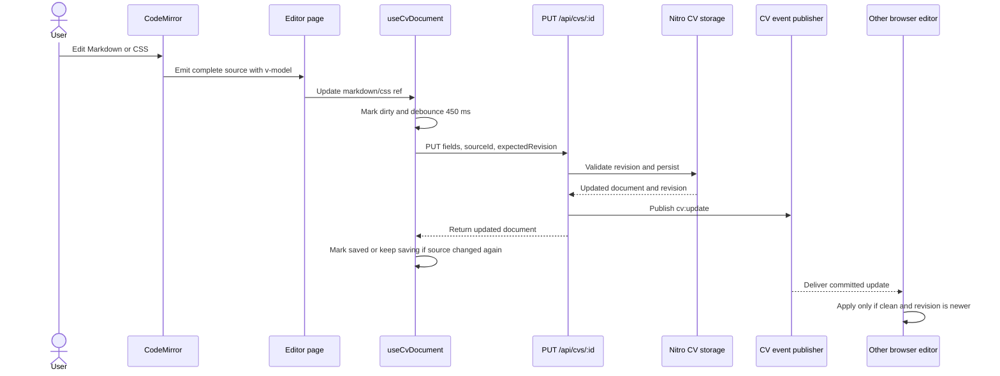
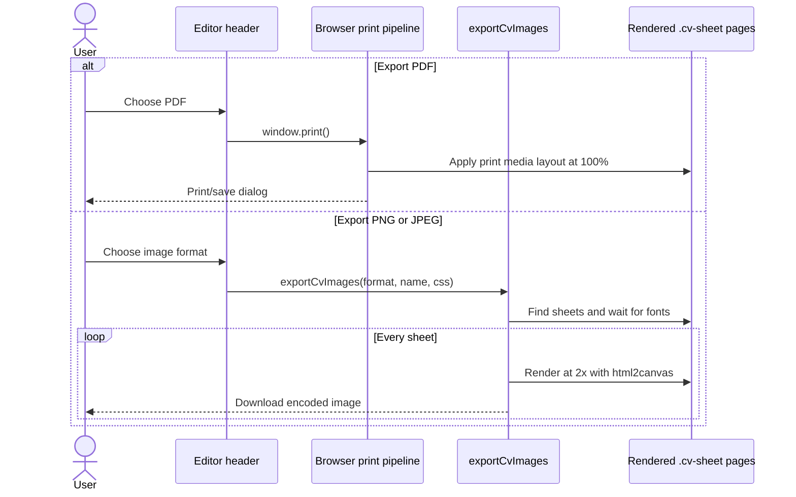

# CV Editor

Last updated: main@d1ae665 | 2026-09-13

## Scope

This spec covers:

- editor pages `app/pages/index.vue` and `app/pages/e/[id].vue`;
- `app/layouts/editor.vue`;
- `app/components/CodePreview.vue` and `app/components/CodeMirror.vue`;
- local profile management at `app/pages/profiles.vue`, consuming `CvProfileProps` from `@core/domain/cv`;
- `app/composables/useCodeMirror.ts` and the browser-facing parts of `useCvDocument.ts`;
- seed assets in `app/data/reference-cv.{md,css}`;
- themes in `app/assets/theme/themes.css`, `useTheme.ts`, and `theme.client.ts`;
- image export in `app/utils/exportCvImage.ts` and browser print behavior.

Document persistence and synchronization are specified in [cv-documents-realtime.md](cv-documents-realtime.md). Standalone headless PDF automation belongs to [mcp-automation.md](mcp-automation.md).

## Editor Routes And Ownership

`/` is an unpersisted placeholder session, analogous to a new-chat route. It starts with placeholder Markdown and reference CSS but does not call the document API or appear in Sessions. After the first source edit settles for 450 ms, the page creates exactly one document with a random UUID through `POST /api/cvs`, refreshes the sidebar, and replaces the route with `/e/<uuid>`; ids never derive from the CV title. Edits arriving during creation are reconciled before navigation, client registration is single-flight, and repository creation rejects an improbable duplicate id. `/e/:id` opens the persisted route-parameter document. New and forked session ids are UUID route identifiers while sidebar and editor-header labels come from the independent persisted `title` field; after rename, the refreshed session index updates both labels without changing the Markdown heading. New drafts start as **Untitled CV**, never as the hash. Legacy title-slug records are soft-migrated to deterministic hashed route ids and old `/e/<slug>` requests resolve and replace-navigate to the hashed route. Both pages disable the default layout and provide source tabs, editor content, and preview content to `app/layouts/editor.vue`.

The editor layout owns the full-window shell, source/preview split, pointer and keyboard resizing, toolbar, activity bar, document/template sidebar, status bar, responsive behavior, and print-only layout. The activity bar links to the explicitly unauthenticated `/profiles` route. It uses the editor layout's `workspace` slot and replaces the Sessions/Templates sidebar with its profile list through the `sidebar` slot rather than introducing a separate shell and provides local-only CRUD for the complete shared `CvProfileProps` shape: identity, contacts, experience, skills, certifications, education, projects, and languages. Records use browser-local storage under `cv-sv:local-profiles:v1`; legacy reduced records are hydrated with missing canonical fields instead of discarded. Selecting a profile clones its raw Vue value before editing so nested reactive proxies cannot cause `structuredClone` to fail and leave an empty form. Its Templates section uses `/api/public/templates` anonymously and the full `/api/cv-templates` catalog with a session. Selecting a template navigates to `/t/:id` and reuses the exact editor/preview split: `content.md` and `style.css` are visible in CodeMirror read-only mode, the rendered preview is also non-interactive, formatting is disabled, and the current CV is never mutated. Editing a cloned template is intentionally deferred. Pages own active Markdown/CSS tab state and export invocation.

A public template offers **Clone to local**. `POST /api/cv-templates/:id/clone` creates immutable version 1 with a unique id, `builtIn: false`, and persisted `tags: ["local"]`; the catalog refreshes and continues displaying the clone read-only.

The Sessions header `+` navigates to `/` without creating a record. On an already-unpersisted `/` draft it resets the placeholder unless registration is already in flight. Only a source edit registers the session, so abandoned placeholders never pollute the sidebar and `master` is never cleared or overwritten.

The split starts at 46%. Pointer resizing attempts to retain a minimum pane width; keyboard resizing clamps source width to 30–70%, and double-click resets it. The document sidebar can be collapsed and resized from 160–420px by pointer or keyboard; its open state and width persist in local storage. At widths below 900px the document sidebar is hidden; below 760px the preview and divider are hidden.

## Blob Import UI

The editor header exposes **Import** on CV/template routes. `app/components/CvImportDialog.vue` accepts one PDF, PNG, JPEG, WebP, TIFF, or BMP blob by picker or drag-and-drop, applies the lower of the server capability and 5 MB client limit, selects a public structure template, and posts multipart bytes to authenticated `POST /api/cv-imports`. That route persists the source artifact and immediately triggers the CV pipeline worker.

The dialog polls job state/progress, exposes warnings and extraction failures, supports cancellation/retry, and retrieves the generated Markdown/CSS preview after success. **Create CV and imported profile** commits with a random document UUID, producing both the template-built editable document and the structured profile snapshot inside its CV application; the sidebar refreshes and navigation moves to `/e/:id`. Closing before commit leaves the current document unchanged.

## Markdown Indicators And Style Isolation

CV Markdown supports the same trailing attribute indicators as `cv-editor`, including `# Name {.cv-name}`, and fenced directives such as `:::contacts`. The sanitized rendered element receives the declared class/id while the indicator remains visible in Markdown source. CodeMirror decorates both trailing `{.class}`/`{#id}` attributes and opening/closing `:::` directive markers. The `{·}` control responds independently in session and read-only template views, hiding or showing those decorated source markers without changing line content, persisted Markdown, or rendered class behavior. Hidden markers use CSS visibility rather than removal from layout, preserving CodeMirror line height and continuous, evenly aligned gutter numbers for directive-only lines.

Template styles target classes supplied explicitly by Markdown indicators, not private client mount classes such as `.cv-sheet` or `.cv-preview-scope`. For example, each reference page is wrapped in the visible `:::resume` directive, its name carries `{.cv-name}`, and `style.css` targets `.resume` and `.cv-name`. `.cv-sheet` remains an application-owned pagination/export hook only. On first read/list, persisted sessions whose CSS still targets `.cv-sheet` or the intermediate `.cv-document` contract are soft-migrated: each Markdown page gains `:::resume`, its first heading gains `{.cv-name}`, CSS selectors move to those indicator classes, unscoped legacy print rules are removed, and the document revision advances. Custom sources without a legacy selector remain byte-for-byte unchanged.

As a second isolation boundary, each preview stylesheet is rewritten through PostCSS so every selector is rooted at `.cv-preview-scope`; `html`, `body`, and `:root` selectors are mapped to that preview root. Global-only imports, namespaces, page/property registrations, font/counter definitions, keyframes, and cascade layers are discarded because they cannot be safely scoped to a DOM subtree. Template CSS therefore cannot style the editor shell or survive visually when switching templates.

## Edit, Autosave, And Realtime Sequence

Conflict responses set the originating editor to `conflict`; transport failures set it to `offline`.

## Source Editing

`CodeMirror` is a controlled `v-model` wrapper over `useCodeMirror()`. The composable owns the editor lifecycle and installs line numbers, history, standard/history keymaps, active-line highlighting, bracket matching, indentation, wrapping, the One Dark theme, and a transparent container theme.

CodeMirror `Compartment`s switch Markdown/CSS language support and reset history without recreating the editor. Markdown enables language data for fenced code and adds larger heading highlighting. External model/tab changes replace the complete CodeMirror document only when the text differs and are explicitly excluded from undo history. Switching tabs resets the history compartment, so Cmd/Ctrl+Z can never restore Markdown into `style.css` or CSS into `content.md`; CodeMirror document changes emit the complete active source string back to Vue. In Markdown mode, toolbar commands wrap selections as bold, italic, link, or inline code and prefix selected lines as headings, quotes, or bullet items. Formatting controls are disabled in CSS mode.

## Markdown And CSS Rendering

`CodePreview` runs Markdown synchronously through `remark-parse`, GFM, directive and attribute-indicator handling, `remark-rehype`, `rehype-sanitize`, and `rehype-stringify`. The sanitizer uses its default schema plus indicator-generated `className` and `id` attributes. Sanitized HTML is the only value passed to `v-html`.

The scoped document stylesheet is assigned to a `<style>` element through `textContent`, not HTML interpolation. CSS remains intentionally user-controlled presentation input, but its selectors are prefixed and its unscopable global at-rules are removed before mounting.

Pagination occurs after Markdown rendering: generated `
` elements split the sanitized HTML into separate `.cv-sheet` articles, and empty segments are discarded. The reference stylesheet sizes sheets as A4 and uses print page breaks between adjacent sheets. Preview controls zoom from 25–200%, reset to 100%, or fit one sheet to the available viewport. Fit mode responds to viewport resizing, the page indicator tracks rendered sheets, and print always renders at 100%.

## Export

The PDF toolbar action calls `window.print()`. Print media rules hide editor chrome and expose the preview sheets; final destination and PDF generation are browser-owned.

PNG/JPEG export calls `exportCvImages()`:

- waits for `document.fonts.ready` when available;
- finds every `.cv-sheet` in the current document;
- lazy-loads `html2canvas` and renders each sheet at 2× scale on white;
- encodes PNG or JPEG at quality `0.95` and triggers one browser download per sheet;
- sanitizes the requested base filename and adds `-page-N` for multiple sheets.

Image export throws if no sheets exist or encoding fails. Remote assets depend on browser canvas/CORS behavior.

## Themes And Accessibility

The application defines Catppuccin Mocha, Catppuccin Latte, and OpenCode token sets. `useTheme()` applies `data-theme` to the root element and stores the id in `localStorage`; the client plugin restores it, defaulting to Mocha.

The editor labels its main regions and icon controls, exposes the divider as a keyboard-focusable separator, and globally reduces animation for `prefers-reduced-motion`. Preview pages receive numbered `aria-label` values.

## Current Gaps

- Split, sidebar create/refresh, help, line/column, word count, and A4 status controls are currently static or emitted without a page-level implementation.
- Scoped document CSS can still initiate external resource loads from declarations such as `background-image: url(...)`.
- Image export has no progress/error UI and creates separate downloads rather than one archive for multi-page CVs.
- There is no visual regression or browser export coverage.
